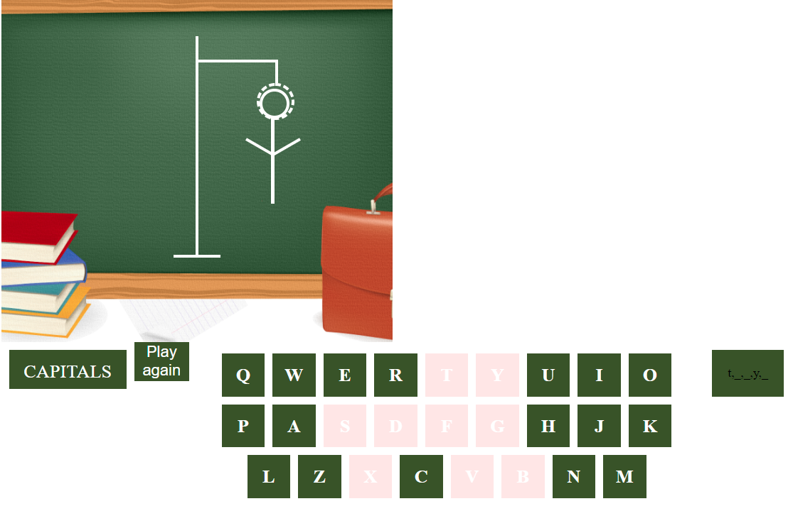

# Hangman

  
  
## About  the project

Hangman game 

**link:** [Hangman](https://sarahdade.github.io/Hangman/)

##  objectives  

* propose an hidden word
* allow the selection of letters
* verify if a selected letter belongs to the word
* count the number of failure (lives)
* check if it's a game over
* check if the word has been found

---  

 ## Technologies
  This project is created with:

* Javascript
* HTML5
* CSS3 

